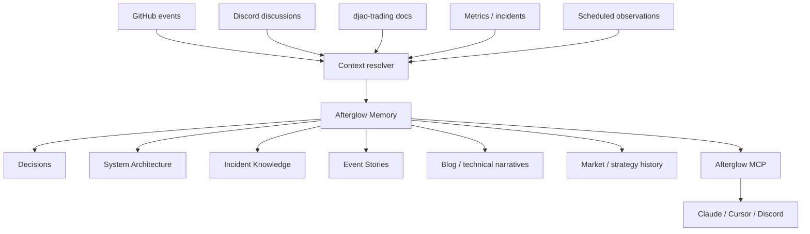
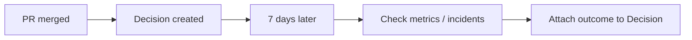
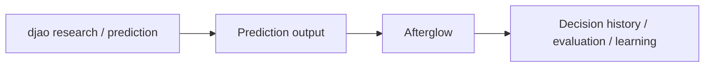
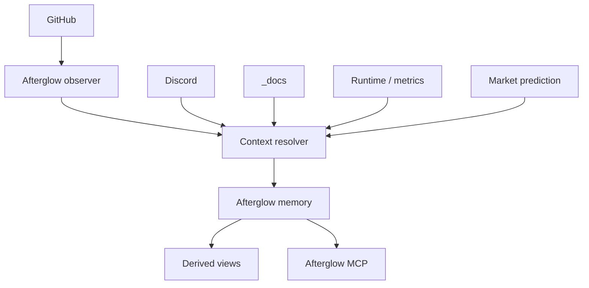

# Afterglow Memory → Derived Knowledge Surfaces

> **Date:** 2026-09-14  
> **Status:** Proposal  
> **Scope:** Afterglow ↔ djao-trading dogfood integration

## Context

djao-trading hiện đã có một lượng lớn knowledge nằm rải rác giữa:

- GitHub code / pull requests / issues
- Discord discussions
- `_docs/YY-MM-DD-*.md` — plans, audits, incidents, investigations
- `_docs/knowledge/` — durable system truth / architecture references
- operational events, metrics, scheduled research jobs
- market-prediction / advisor outputs

Các nguồn này chứa rất nhiều bằng chứng, nhưng để trả lời một câu hỏi đơn giản như:

> Tại sao hệ thống hiện tại được thiết kế như vậy?

agent vẫn phải tự tìm nhiều artifact, phân biệt tài liệu cũ / mới, reconstruct timeline, rồi suy ra decision hiện tại.

Afterglow nên đứng phía trên các nguồn đó như **organizational memory**.

Nó không thay GitHub, Discord, docs, metrics hay research engine. Các nguồn này vẫn là evidence.

## Decision

Afterglow sẽ giữ **canonical memory** ở dạng:

- Evidence
- Event
- Decision
- Service
- Incident
- relationships giữa các entity
- outcome / verification của Decision

Các artifact cấp cao hơn như:

- System Architecture
- Incident Knowledge
- Event Story
- Blog / technical narrative
- Market / strategy history

sẽ được xem là **derived views** trên cùng một memory graph, không phải primitive độc lập cần maintain thủ công.

Đơn vị tri thức trung tâm vẫn là **Decision**.

## Mental model



## Source artifacts remain source artifacts

Afterglow không nên copy mọi thứ rồi tự biến thành một data lake mới.

Boundary:

| Source | Vai trò |
| --- | --- |
| GitHub | event anchor + implementation evidence |
| Discord | discussion context / alternatives / reasoning |
| djao-trading `_docs` | plans, audits, incident notes, current developer context |
| Metrics / runtime | outcome evidence |
| Research / prediction jobs | model output + measured result |
| Afterglow | organizational interpretation + decision history |

Source artifact vẫn sống ở source của nó. Afterglow lưu reference, relationship và phần diễn giải cần thiết để reconstruct organizational memory.

## Discord: context, not transcript archive

Không ingest toàn bộ Discord conversation vào memory.

Không:

```text
every Discord message
        ↓
Afterglow database
```

Ưu tiên:

```text
meaningful event
      ↓
resolver searches nearby Discord context
      ↓
relevant messages become evidence
      ↓
Decision
```

Ngoài event-driven resolution, có thể có explicit trigger:

```text
@afterglow remember this decision
```

Trigger này chỉ là một cách mở resolver; canonical record vẫn cần evidence và relationship, không phải copy nguyên conversation.

## Periodic jobs: verify memory, not summarize everything

Scheduled jobs không nên chạy kiểu:

```text
every hour → summarize all activity
```

Các job hữu ích hơn:

- post-deploy outcome check
- decision verification
- architecture drift check
- incident follow-up
- weekly unresolved-decision review
- prediction / strategy outcome reconciliation

Ví dụ:



Như vậy memory không chỉ nói:

> Chúng ta chọn A vì X.

Mà còn có thể nói:

> Chúng ta chọn A vì X; sau deploy latency giảm, error rate ổn định và không xuất hiện regression tương ứng.

## Architecture as a synthesized view

Architecture không nhất thiết phải tồn tại dưới dạng một canonical markdown document được maintain bằng tay.

Afterglow có thể dựng current architecture từ:

- current Decisions
- superseded Decisions
- Service relationships
- actual GitHub implementation
- deployment / ownership relationships

Ví dụ user hỏi:

> What is the current trading architecture?

Afterglow có thể synthesize:

```text
Market Data
    ↓
Signal
    ↓
Allocation
    ↓
Trade Server
    ↓
Exchange Adapter
```

Nhưng giá trị lớn hơn nằm ở câu hỏi tiếp theo:

> Why is Trade Server separated from the trading bot?

Afterglow phải trả được:

- problem ban đầu
- alternatives
- decision
- PR hiện thực hóa
- incident / evidence liên quan
- outcome
- decision nào đã bị supersede

Architecture vì vậy là **projection của decision history**, không phải một nguồn truth riêng biệt.

## Event Story as a timeline projection

Event Story phù hợp tự nhiên với model của Afterglow.

Ví dụ:

```text
09:03 latency rises
09:08 CHM warns
09:12 Discord investigation
09:25 root cause identified
10:03 PR opened
10:32 PR merged
10:44 deployment
11:10 metrics recovered
```

Một Event Story có thể được dựng từ:

```text
Timeline
+ Decisions
+ Evidence
+ Outcome
```

Event Story là narrative projection của memory graph và vẫn phải link ngược được về evidence gốc.

## Blog as a publishing transform

Blog không phải company memory.

Blog là một transform:

```text
company memory
      ↓
select decision / incident / architecture evolution
      ↓
storytelling transform
      ↓
blog post
```

Ví dụ:

- Tại sao chúng tôi tách Trade Server khỏi trading bot
- Một outage đã thay đổi cách chúng tôi thiết kế ownership
- Từ incident đến architecture decision: cách một trading system tiến hóa

Generated article có thể được edit / publish ở hệ thống khác. Afterglow chỉ cung cấp grounded source material và traceability.

Điều này giữ Afterglow khỏi trượt thành CMS.

## Market prediction boundary

Market prediction **không thuộc Afterglow core**.

Prediction vẫn nên nằm trong djao research / advisor system:

```text
market data
news
economic events
models
signals
      ↓
market prediction
```

Afterglow có thể nhớ:

- prediction nào đã được tạo
- evidence nào hỗ trợ prediction
- prediction dẫn tới decision gì
- model / methodology nào được thay đổi
- outcome thực tế
- vì sao strategy đổi sau outcome đó

Flow:



Afterglow không nên trở thành prediction engine.

Nếu Afterglow trực tiếp sở hữu market-data pipeline, signal generation hoặc trading model execution, boundary sản phẩm sẽ bị phá và platform bắt đầu nuốt chính djao-trading.

## djao-trading integration

djao-trading là candidate dogfood tốt vì hiện đã có cả:

- dated plans
- incidents
- canonical architecture docs
- GitHub implementation history
- Discord discussion
- metrics / monitoring
- AI advisor / prediction outputs

Target integration:



## Relationship to `djao-trading/_docs`

Không nên xoá `_docs` trong giai đoạn đầu.

Tách vai trò:

```text
djao-trading/_docs
=
working memory

Afterglow
=
organizational memory
```

### Keep in djao-trading

Các artifact gần code vẫn có giá trị:

- implementation plan
- investigation scratchpad
- benchmark
- migration checklist
- short-lived audit
- runbook / skill

### Candidate to be replaced over time

`_docs/knowledge/` hiện đóng vai trò:

> durable system truth

Đây là phần gần nhất với Afterglow.

Long-term direction có thể là:

```text
plan / implementation / PR / runtime evidence
                  ↓
              Afterglow
                  ↓
          canonical Decision
                  ↓
        generated architecture view
```

Khi confidence đủ cao, `_docs/knowledge/` có thể:

1. ngừng là source of truth;
2. trở thành generated snapshot / export từ Afterglow;
3. hoặc dần được deprecated.

Không migrate trước khi resolver chứng minh đủ reliability.

## Migration path

### Phase 1 — Read-only dogfood

- Afterglow đọc djao-trading GitHub + `_docs`
- Discord chỉ được query khi resolver cần context
- existing docs vẫn là source of truth

### Phase 2 — Decision extraction

Mỗi PR merge quan trọng:

```text
PR merged
   ↓
observer
   ↓
resolver
   ↓
Decision candidate
   ↓
evidence links
```

So sánh Decision với understanding hiện tại trong `_docs/knowledge/`.

### Phase 3 — Outcome verification

Scheduled jobs gắn outcome sau deploy:

- metrics
- regressions
- incidents
- follow-up PRs
- prediction result

### Phase 4 — Derived views

Expose qua MCP:

- `why_decision(...)`
- `service_history(...)`
- `current_architecture(...)`
- `event_story(...)`
- `what_changed(...)`

Blog / narrative generation dùng cùng memory graph.

### Phase 5 — Knowledge source migration

Chỉ khi Afterglow consistently reconstruct đúng current truth:

- `_docs/knowledge/` không còn canonical
- architecture docs có thể generated
- old docs vẫn giữ như evidence / history

## Product boundary

Afterglow **is**:

- organizational memory
- decision history
- evidence graph
- context reconstruction
- synthesized views grounded in source artifacts

Afterglow **is not**:

- Discord transcript archive
- generic document warehouse
- CMS
- market prediction engine
- metrics database
- replacement cho GitHub

## First proof for djao-trading

Một proof đủ mạnh:

```text
Discord discussion
      +
existing djao doc
      +
PR merged
      +
runtime outcome
      ↓
Afterglow Decision
      ↓
MCP answers:
"why does this architecture exist?"
```

Senior / maintainer đọc output và xác nhận:

> Đúng, đây là lý do hệ thống trở thành như vậy.

Sau đó từ **cùng record**, Afterglow phải có khả năng dựng:

1. current architecture explanation;
2. event story;
3. technical blog draft;
4. historical comparison với decision cũ;
5. outcome sau deploy.

Nếu cần duplicate nhiều memory object riêng cho từng output, model đang sai.

## Consequences

### Positive

- giảm nhu cầu manually maintain duplicate architecture docs
- knowledge không bị khóa trong một repository
- Discord / GitHub / metrics có thể được nối thành một story có traceability
- một Decision có thể phục vụ nhiều use case khác nhau
- organizational history vẫn sống khi engineer rời team

### Trade-offs

- resolver quality trở thành critical path
- generated architecture có thể sai nếu implementation / evidence thiếu
- Discord retrieval cần permission + privacy boundary rõ
- outcome jobs có thể attach correlation sai nếu heuristic yếu
- không được promote generated narrative thành canonical fact mà không giữ evidence

## What would change this decision

Cần xem lại model nếu:

- Architecture không thể derive ổn định từ Decision + implementation graph
- Event Story đòi hỏi primitive riêng không thể biểu diễn qua Event / Decision / Evidence
- resolver không tìm được Discord context với precision đủ cao
- generated knowledge thường xuyên diverge khỏi repo implementation
- djao-trading cần một domain model riêng quá đặc thù để Afterglow core phải hiểu trading semantics

Trong trường hợp đó nên thêm projection/domain adapter, không vội làm phình canonical memory model.

## Evidence / references

- Afterglow README: Decision là knowledge unit trung tâm; GitHub là event anchor.
- Afterglow `_docs/README.md`: folder này chỉ là developer log khi xây Afterglow, không phải organizational memory.
- djao-trading `_docs/README.md`: dated plans / audits tách khỏi durable knowledge.
- djao-trading `_docs/knowledge/README.md`: `knowledge/` hiện là current truth / north-star.
